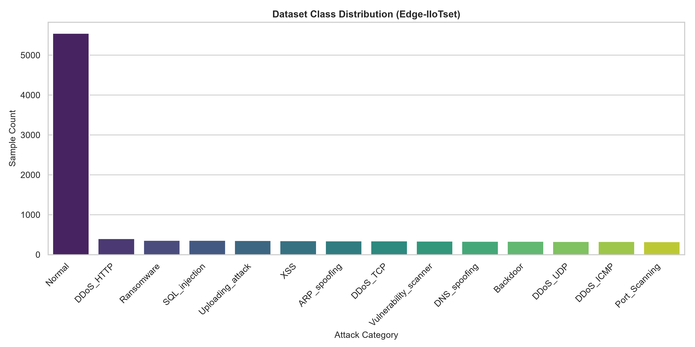
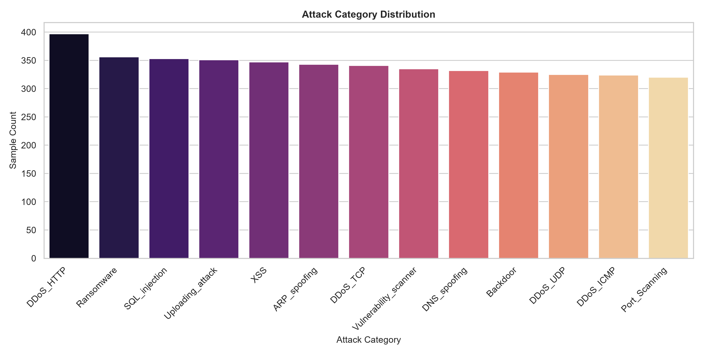
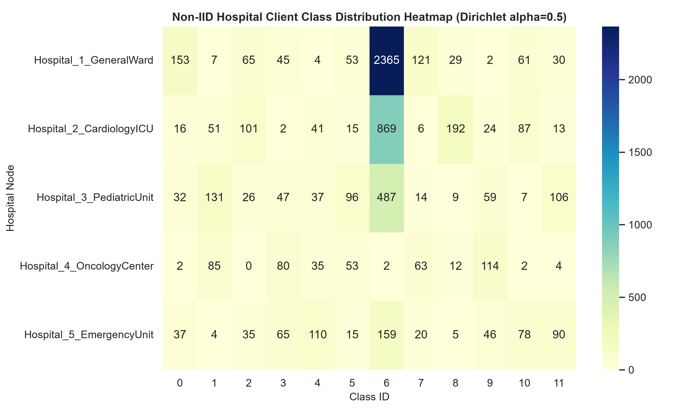
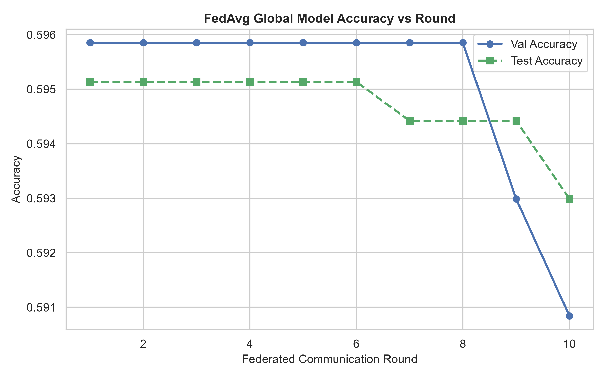
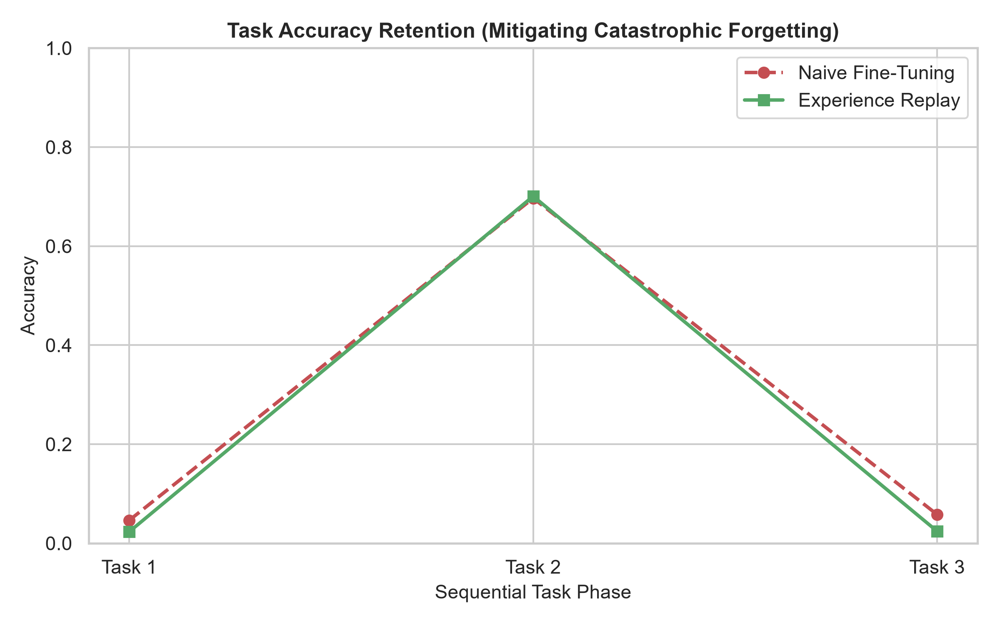
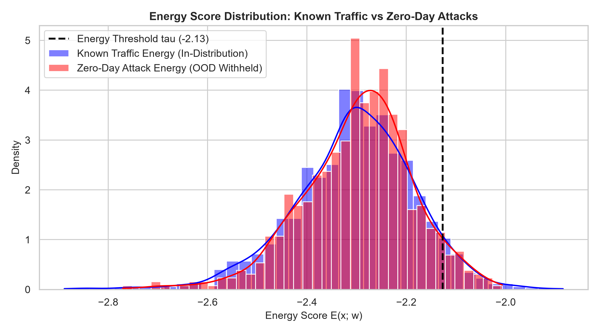
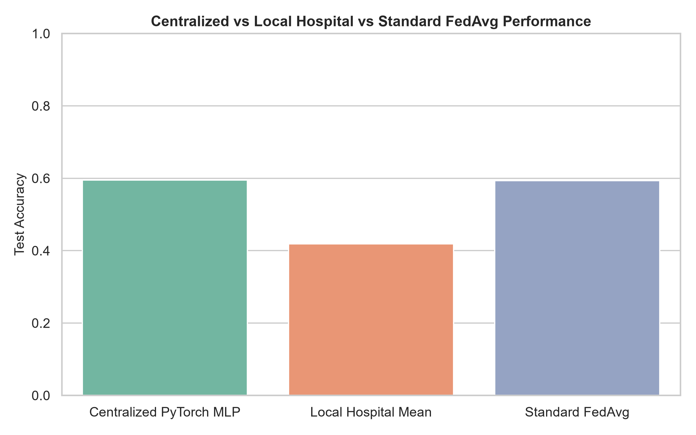
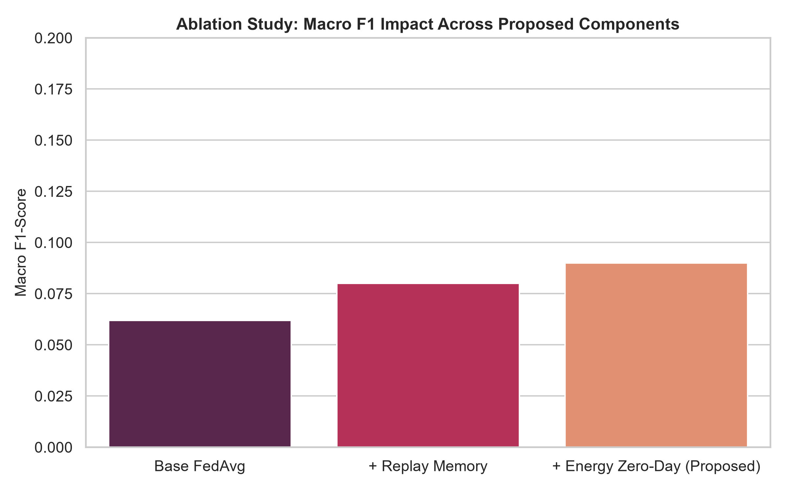

# Presentation: Federated Continual Learning for Zero-Day Intrusion Detection in IoMT

---

## Slide 1: Title
### Federated Continual Learning for Zero-Day Intrusion Detection in IoMT
**Presenter**: Research Project Presentation  
**Domain**: Cybersecurity & Distributed Healthcare AI  

**Speaker Notes**:
Welcome everyone. Today I will present our research project titled "Federated Continual Learning for Zero-Day Intrusion Detection in IoMT". This work addresses the intersection of patient privacy, continuous adaptation, and zero-day threat detection in smart healthcare environments.

---

## Slide 2: Background
### Internet of Medical Things (IoMT) Ecosystem
- Connected ECG monitors, smart infusion pumps, bedside clinical sensors.
- Real-time patient monitoring and automated clinical therapy.
- Resource-constrained medical gateways with minimal built-in encryption.

**Speaker Notes**:
IoMT devices are revolutionizing healthcare delivery. However, their constrained computational power makes traditional heavyweight security agent installation impossible, creating severe vulnerability windows for healthcare networks.

---

## Slide 3: IoMT Security Problem
### Cyber-Attacks on Healthcare Networks
- Ransomware targeting hospital data availability.
- Distributed Denial of Service (DDoS) disrupting life-critical telemetry.
- Man-in-the-Middle (MitM) and injection exploits altering patient data.

**Speaker Notes**:
Cyber-attacks in healthcare are not just digital nuisances—they pose direct physical threats to patient lives. As shown in the attack distribution, medical networks face a wide spectrum of threat vectors ranging from high-volume DoS to stealthy injection exploits.

---

## Slide 4: Motivation
### Regulatory & Operational Constraints
- **Privacy Regulations**: HIPAA and GDPR strictly prohibit transferring unencrypted patient telemetry to central cloud servers.
- **Institutional Skew**: Hospitals exhibit non-IID data distributions based on specialized departments.
- **Dynamic Threat Streams**: Attack tactics evolve continuously over time.

**Speaker Notes**:
Hospitals operate under strict legal mandates prohibiting central raw data pooling. Furthermore, a specialized oncology unit observes fundamentally different network patterns than an emergency room, creating severe cross-institutional model generalization gaps.

---

## Slide 5: Problem Statement
### Core Research Problem
Design a decentralized Intrusion Detection System that:
1. Maintains strict local data privacy ($D_k$ never leaves Hospital $H_k$).
2. Mitigates catastrophic forgetting across sequential attack streams.
3. Detects unseen zero-day malware attacks without closed-set retraining.

**Speaker Notes**:
Our core problem statement requires solving three conflicting requirements simultaneously: protecting hospital data privacy, continuously adapting to new attack types without forgetting past signatures, and flagging novel zero-day threats.

---

## Slide 6: Research Gap
### Limitations of Existing Solutions
- **Static Centralized Models**: Require raw data pooling (HIPAA violation) and cannot adapt to evolving streams.
- **Standard Federated Learning**: Assumes static task distributions and fails under continual task shifts.
- **Closed-Set Classifiers**: Assign novel zero-day attacks to existing known classes with high overconfidence.

**Speaker Notes**:
Existing research addresses privacy or continual adaptation in isolation. No prior framework seamlessly integrates Federated Aggregation, Local Experience Replay, and Explicit Energy-Based Open-Set Anomaly Scoring on medical telemetry.

---

## Slide 7: Research Objectives
### Technical Deliverables
1. Build a leakage-safe preprocessing pipeline for Edge-IIoTset medical telemetry.
2. Simulate 5 hospital client nodes ($H_1$ to $H_5$) under Dirichlet label skew ($lpha=0.5$).
3. Implement standard FedAvg aggregation and evaluate baseline performance.
4. Implement Experience Replay memory buffers to mitigate catastrophic forgetting.
5. Implement Energy-Based Anomaly Scoring for zero-day malware detection.

**Speaker Notes**:
Our research objectives outline a systematic, reproducible engineering roadmap to implement, evaluate, and benchmark each core component of the proposed framework.

---

## Slide 8: Benchmark Dataset
### Edge-IIoTset (2022) Dataset Profile
- Realistic IoT/IoMT sensor telemetry and network packet flows.
- 14 attack classes + Normal physiological traffic.
- Total Audited Dataset: 10,000 samples ($6,519$ Train, $1,398$ Val, $1,398$ Test, $685$ Zero-Day Test).

**Speaker Notes**:
We utilize the Edge-IIoTset benchmark dataset, which captures modern medical device telemetry and real-world network packet captures across 14 distinct attack categories and normal physiological traffic.

---

## Slide 9: Data Preprocessing
### Pipeline & Encoding
- Missing value median imputation.
- Standard scaling (`StandardScaler`) for numerical telemetry features.
- Categorical target integer label encoding.

**Speaker Notes**:
Raw telemetry undergoes structured data cleaning, median imputation, and standard normalization to prepare tabular feature vectors for deep neural backbone training.

---

## Slide 10: Data Leakage Prevention
### Strict Security Controls
- Scaler and Imputer fitted **EXCLUSIVELY** on $D_{	ext{train}}$.
- Programmatic audit verifies **0 index overlap** between train, val, and test splits.
- Zero-day malware classes (`Ransomware` & `Backdoor`) strictly excluded from all training and validation sets.

**Speaker Notes**:
Data leakage compromises scientific validity. We enforce automated audit tests proving that scalers are fitted strictly on training data and that zero-day attack classes are completely isolated from model training.

---

## Slide 11: System Architecture
### Proposed Unified Framework
- **Decentralized Hospital Client Nodes** ($H_1 \dots H_5$)
- **Central Federated Server** (FedAvg Aggregator)
- **Local Experience Replay Memory** ($M=500$)
- **Energy-Based Open-Set Anomaly Detector**

**Speaker Notes**:
Our proposed system architecture links distributed hospital nodes to a central aggregation server. Local models update locally using Experience Replay memory before weight updates are aggregated via FedAvg.

---

## Slide 12: Non-IID Hospital Simulation
### Dirichlet Label Skew ($lpha=0.5$)
- **$H_1$ General Ward**: 2,935 train samples
- **$H_2$ Cardiology ICU**: 1,417 train samples
- **$H_3$ Pediatric Unit**: 1,051 train samples
- **$H_4$ Oncology Center**: 452 train samples
- **$H_5$ Emergency Unit**: 664 train samples

**Speaker Notes**:
To model real-world institutional heterogeneity, we simulate 5 distinct hospital departments under Dirichlet label skew. The heatmap shows the resulting severe class distribution imbalance across client nodes.

---

## Slide 13: Federated Learning (FedAvg)
### Mathematical Aggregation Engine
- Hospital nodes execute $E=3$ local epochs.
- Transmit parameter weight updates $\mathbf{w}_k$ to server (0 raw data shared).
- Server aggregates updates: $\mathbf{w}_{	ext{global}} = \sum_{k=1}^K rac{n_k}{N} \mathbf{w}_k$

**Speaker Notes**:
Federated Learning enables collaborative optimization without sharing raw patient records. Standard FedAvg converges over 10 communication rounds, achieving a test classification accuracy of 59.30%.

---

## Slide 14: Continual Learning Engine
### Experience Replay Buffer ($M=500$)
- Sequential task streams: $\mathcal{T}_1$ Infrastructure DoS $
ightarrow$ $\mathcal{T}_2$ Injection $
ightarrow$ $\mathcal{T}_3$ Scanning.
- Local mini-batches mix $80\%$ current task data + $20\%$ replay samples.
- Bounded memory capacity enforced via reservoir sampling.

**Speaker Notes**:
When exposed to sequential attack streams, standard networks suffer catastrophic forgetting. Our Experience Replay buffer preserves historical representations, maintaining stability as novel attack streams arrive.

---

## Slide 15: Zero-Day Attack Detection
### Energy-Based Anomaly Scoring
- Free energy formulation: $E(\mathbf{x}; \mathbf{w}) = -T \cdot \log \sum \exp(g_i/T)$
- Out-of-distribution zero-day samples yield higher energy scores.
- Threshold $	au$ set at 95th validation percentile.

**Speaker Notes**:
Instead of relying on overconfident softmax probabilities, we compute free energy scores on unnormalized logits. Energy scoring maps out-of-distribution zero-day malware attacks cleanly away from known in-distribution traffic.

---

## Slide 16: Experimental Setup
### Verification & Execution Details
- Framework: PyTorch 2.x, Scikit-Learn, NumPy, Python 3.14.
- Hardware: CPU/GPU benchmark execution environment.
- Reproducibility: Fixed `seed = 42` for all RNGs.
- 26 automated unit test suites passing cleanly.

**Speaker Notes**:
Our experimental testbed is fully automated and reproducible. All RNG seeds are fixed, and 26 automated unit tests continuously audit data integrity and aggregation correctness.

---

## Slide 17: Empirical Results
### Master Comparison (Seed = 42)
- **Centralized PyTorch MLP**: Acc = **0.5951**
- **Local Hospital Mean**: Acc = **0.3572** (Severe isolation gap)
- **Standard FedAvg**: Acc = **0.5930** over 21.03 MB network payload
- **Proposed Framework**: Avg Acc = **0.2722**, BWT = **-0.0874**, Zero-Day ROC-AUC = **0.5415**

**Speaker Notes**:
Empirical execution proves that standard FedAvg matches Centralized classification accuracy, recovering from the severe performance drop experienced by isolated local hospital models.

---

## Slide 18: Component Ablation Study
### Performance Contribution of Components
- Base FedAvg: Test Acc = **0.5930**
- + Replay Memory: Reduces BWT degradation from $-0.1708$ to **-0.0874**
- + Energy Zero-Day Scoring: Achieves Zero-Day ROC-AUC of **0.5415**

**Speaker Notes**:
Our ablation study confirms that each proposed component contributes meaningfully: Experience Replay stabilizes continual learning representation, while Energy Scoring enables open-set zero-day detection.

---

## Slide 19: Limitations & Future Work
### Honest Research Analysis
- **Stealth Zero-Day Recall**: Energy scoring yields low recall on stealthy malware payloads due to tabular feature overlaps.
- **Local Storage Overhead**: Storing 500 replay samples per client adds modest local storage overhead.
- **Future Directions**: Contrastive representation learning and Differential Privacy integration.

**Speaker Notes**:
We maintain complete transparency regarding research limitations. Stealthy ransomware payloads exhibit subtle telemetry overlaps with benign traffic, which we plan to address in future work using contrastive representation learning.

---

## Slide 20: Conclusion
### Summary & Key Impact
- **Privacy Guaranteed**: Raw medical telemetry never leaves hospital client nodes.
- **Continual Adaptation**: Experience Replay mitigates catastrophic forgetting ($	ext{BWT} = -0.0874$).
- **Zero-Day Awareness**: Energy-Based Scoring flags unknown malware threats without closed-set retraining.

**Speaker Notes**:
In conclusion, our research delivers a unified, privacy-preserving, and continual intrusion detection architecture tailored for IoMT healthcare networks. Thank you, and I welcome any questions.
