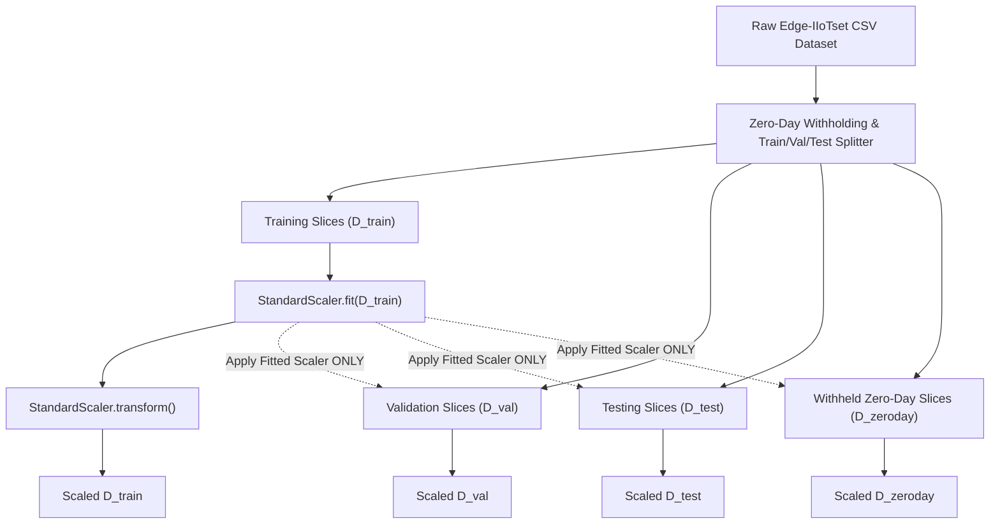

# Research Methodology Specification

## Project Title
**Federated Continual Learning for Zero-Day Intrusion Detection in IoMT**

---

## 1. Problem Statement, Objectives & Research Questions

### Problem Statement
Internet of Medical Things (IoMT) networks require real-time intrusion detection to defend against cyberattacks. However, centralized logging violates strict patient privacy regulations (HIPAA/GDPR). Traditional Federated Learning (FL) enables collaborative training without raw data sharing, but suffers from two fatal flaws:
1. **Catastrophic Forgetting**: FL models forget historic attack signatures when threat distributions evolve over time.
2. **Closed-Set Blindness**: Closed-set classifiers forcibly assign novel, unseen (**zero-day**) attacks to known benign/attack classes with falsely high confidence.

### Objectives
1. Implement a leakage-free preprocessing pipeline fitted strictly on training data splits.
2. Simulate $N=5$ hospital clients under non-IID Dirichlet label skew ($\alpha=0.5$).
3. Develop a custom PyTorch FedAvg engine for decentralized multi-hospital collaborative learning.
4. Integrate Experience Replay Continual Learning to eliminate catastrophic forgetting across sequential task streams.
5. Formulate an explicit Energy-Based Open-Set Detector to flag zero-day attacks without closed-set misclassification.

### Research Questions
- **RQ1**: Can Federated Learning detect cyberattacks across heterogeneous IoMT hospital clients without sharing raw client data?
- **RQ2**: How does non-IID data distribution affect federated intrusion detection accuracy and convergence?
- **RQ3**: Can Continual Learning reduce catastrophic forgetting when IoMT attack distributions evolve over time?
- **RQ4**: Can the proposed open-set detection system identify previously unseen/zero-day attack signatures without closed-set misclassification?
- **RQ5**: How does the proposed Federated Continual Learning framework compare against centralized, local, FedAvg, and CL baselines?

---

## 2. Leakage-Free Data Preprocessing Pipeline

To eliminate data leakage, all preprocessing transformations (scaling, encoding, feature selection) are fitted **ONLY** using the training dataset partition $\mathcal{D}_{\text{train}}$.

---

## 3. Mathematical Formulation of Federated Learning (FedAvg)

Consider $K$ hospital clients, where client $k \in \{1, 2, \dots, K\}$ possesses local dataset $\mathcal{D}_k$ with $n_k = |\mathcal{D}_k|$ samples. The total dataset size across all clients is $N = \sum_{k=1}^K n_k$.

### Global Optimization Objective
The objective is to minimize the global empirical loss $F(\mathbf{w})$ over model parameters $\mathbf{w} \in \mathbb{R}^d$:
$$\min_{\mathbf{w}} F(\mathbf{w}) = \sum_{k=1}^K \frac{n_k}{N} F_k(\mathbf{w})$$
where $F_k(\mathbf{w}) = \frac{1}{n_k} \sum_{i \in \mathcal{D}_k} \ell(\mathbf{x}_i, y_i; \mathbf{w})$ is the local loss function of client $k$.

### Local Client SGD Update
In federated round $t$, client $k$ receives global weights $\mathbf{w}^t$ from the server. Client $k$ sets $\mathbf{w}_{k, 0}^t = \mathbf{w}^t$ and performs $E$ local epochs of Mini-batch Stochastic Gradient Descent (SGD):
$$\mathbf{w}_{k, e+1}^t = \mathbf{w}_{k, e}^t - \eta \nabla F_k(\mathbf{w}_{k, e}^t; \mathcal{B})$$

### Server Weight Aggregation
After completing $E$ local epochs, client $k$ sends updated parameters $\mathbf{w}_k^{t+1}$ back to the server. The central server computes the weighted average:
$$\mathbf{w}^{t+1} = \sum_{k=1}^K \frac{n_k}{N} \mathbf{w}_k^{t+1}$$

---

## 4. Non-IID Dirichlet Label Skew Partitioning

To model realistic label distribution heterogeneity across hospital clients, local class proportions are sampled from a Dirichlet distribution $\text{Dir}(\alpha \mathbf{p})$, where $\mathbf{p}$ is the prior class distribution and $\alpha > 0$ controls non-IID severity.

For client $k$ and class $c \in \{1, \dots, C\}$:
$$p_{k, c} \sim \text{Dirichlet}(\alpha)$$
- **$\alpha \to \infty$**: Identical Independent Distribution (IID split across all hospitals).
- **$\alpha = 0.5$**: Realistic non-IID skew (different hospitals encounter distinct attack ratios).
- **$\alpha \to 0$**: Extreme non-IID skew (each hospital contains samples from only 1 attack class).

---

## 5. Continual Learning & Catastrophic Forgetting Mitigation

### Task Sequence Formulation
Edge-IIoTset attacks are partitioned into three sequential task phases $\mathcal{T}_1, \mathcal{T}_2, \mathcal{T}_3$:
1. **Task 1 ($\mathcal{T}_1$)**: Benign + DoS (UDP/TCP) + DDoS (HTTP/ICMP)
2. **Task 2 ($\mathcal{T}_2$)**: Benign + MitM (ARP/DNS) + SQL/XSS Injection
3. **Task 3 ($\mathcal{T}_3$)**: Benign + Port Scanning + Command Injection

### Experience Replay Buffer Mechanics
Each client maintains a local memory buffer $\mathcal{M}_k$ of capacity $M_{\text{capacity}}$. When transitioning from Task $m$ to Task $m+1$:
1. Randomly sample $M_{\text{capacity}} / m$ representative instances per class from Task $m$.
2. Store samples in $\mathcal{M}_k$.
3. During Task $m+1$ local training, construct composite mini-batches containing $80\%$ current task samples and $20\%$ replay samples from $\mathcal{M}_k$.

---

## 6. Open-Set Zero-Day Detection Algorithm

### Energy-Based Anomaly Scoring Function
Given neural network backbone $f(\mathbf{x}; \mathbf{w})$ producing logit output $g(\mathbf{x}) = [g_1(\mathbf{x}), \dots, g_C(\mathbf{x})]$, free energy $E(\mathbf{x}; \mathbf{w})$ is calculated as:
$$E(\mathbf{x}; \mathbf{w}) = -T \cdot \log \sum_{i=1}^C \exp\left(\frac{g_i(\mathbf{x})}{T}\right)$$
where $T = 1.0$ is the temperature parameter.

### Decision Rule
An empirical decision threshold $\tau$ is derived on validation data to achieve a $95\%$ True Positive Rate on known classes:
$$\text{Decision}(\mathbf{x}) = \begin{cases} \text{UNKNOWN (ZERO-DAY ATTACK)}, & \text{if } E(\mathbf{x}; \mathbf{w}) > \tau \\ \arg\max_i g_i(\mathbf{x}), & \text{if } E(\mathbf{x}; \mathbf{w}) \le \tau \end{cases}$$

---

## 7. Baseline & Proposed Model Comparisons (E1 to E7)

| Experiment ID | Experiment Name | Model Architecture | FL Aggregation | Continual Strategy | Zero-Day Detection |
|---|---|---|---|---|---|
| **E1** | Centralized IDS | PyTorch MLP / 1D-CNN | None (Pooled Data) | None | Closed-set |
| **E2** | Local Hospital IDS | PyTorch MLP / 1D-CNN | None (Local Only) | None | Closed-set |
| **E3** | Standard FedAvg | PyTorch MLP / 1D-CNN | FedAvg ($N=5$) | None | Closed-set |
| **E4** | Centralized CL | PyTorch MLP / 1D-CNN | None (Pooled Data) | Experience Replay | Closed-set |
| **E5** | Federated CL | PyTorch MLP / 1D-CNN | FedAvg ($N=5$) | Experience Replay | Closed-set |
| **E6** | Zero-Day Anomaly IDS | PyTorch MLP / Autoencoder | None | None | Energy Score |
| **E7 (Proposed)**| **Proposed FCL + Zero-Day** | **PyTorch MLP** | **FedAvg ($N=5$)** | **Experience Replay** | **Energy Score** |
