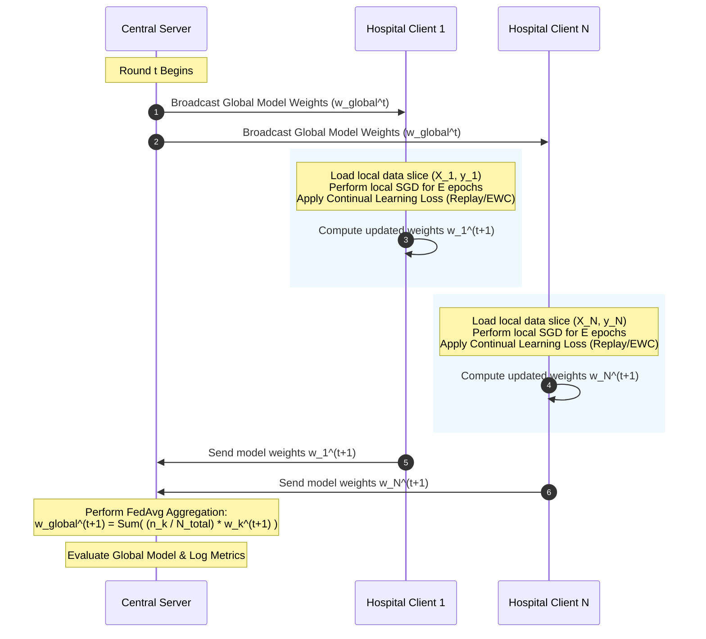
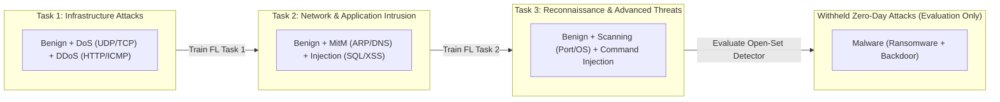
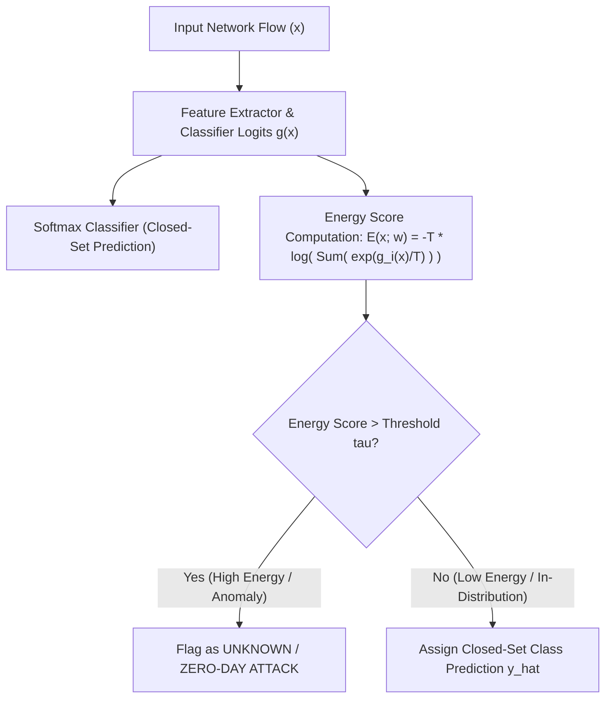

# System Architecture Specification

## Project Title
**Federated Continual Learning for Zero-Day Intrusion Detection in IoMT**

---

## 1. Executive Summary & Architecture Overview
This document specifies the complete system architecture for our **Federated Continual Learning Zero-Day Intrusion Detection System (IDS)**. Designed for heterogeneous Internet of Medical Things (IoMT) environments, the architecture enables $N \ge 5$ simulated hospital clients to collaboratively train a deep neural network intrusion detector without transferring raw network traffic or patient telemetry to a central authority. 

The architecture incorporates three core pillars:
1. **Decentralized Privacy-Preserving Learning**: FedAvg-based local parameter updating and weight aggregation across non-IID hospital client distributions.
2. **Continual Learning (Catastrophic Forgetting Mitigation)**: Sequential task learning coupled with experience replay / EWC to retain historic attack signatures as network threat distributions evolve.
3. **Open-Set Anomaly Detector**: Energy-based scoring and Mahalanobis distance estimation to explicitly flag unseen (zero-day) attacks, avoiding closed-set misclassification.

---

## 2. End-to-End System Architecture

The overall system architecture consists of a central **Federated Aggregation Server** connected to $N=5$ simulated hospital client nodes over a secure parameter exchange interface.

```mermaid
graph TD
    subgraph Server["Central Federated Server"]
        Aggregator["FedAvg Weight Aggregator"]
        GlobalModel["Global Model Weights (w_global)"]
        TaskScheduler["Continual Task Scheduler"]
        ZeroDayEvaluator["Open-Set Zero-Day Evaluator"]
    end

    subgraph H1["Hospital 1 (General Ward)"]
        H1_Data["Local Data (Non-IID Partition 1)"]
        H1_Prep["Local Preprocessor (Fitted Train-only)"]
        H1_Model["Local Model (w_1)"]
        H1_CL["Replay Buffer / CL Loss"]
    end

    subgraph H2["Hospital 2 (Cardiology ICU)"]
        H2_Data["Local Data (Non-IID Partition 2)"]
        H2_Prep["Local Preprocessor (Fitted Train-only)"]
        H2_Model["Local Model (w_2)"]
        H2_CL["Replay Buffer / CL Loss"]
    end

    subgraph H3["Hospital 3 (Pediatric Unit)"]
        H3_Data["Local Data (Non-IID Partition 3)"]
        H3_Prep["Local Preprocessor (Fitted Train-only)"]
        H3_Model["Local Model (w_3)"]
        H3_CL["Replay Buffer / CL Loss"]
    end

    subgraph H4["Hospital 4 (Oncology Center)"]
        H4_Data["Local Data (Non-IID Partition 4)"]
        H4_Prep["Local Preprocessor (Fitted Train-only)"]
        H4_Model["Local Model (w_4)"]
        H4_CL["Replay Buffer / CL Loss"]
    end

    subgraph H5["Hospital 5 (Emergency Unit)"]
        H5_Data["Local Data (Non-IID Partition 5)"]
        H5_Prep["Local Preprocessor (Fitted Train-only)"]
        H5_Model["Local Model (w_5)"]
        H5_CL["Replay Buffer / CL Loss"]
    end

    GlobalModel -->|"Broadcast w_global"| H1_Model
    GlobalModel -->|"Broadcast w_global"| H2_Model
    GlobalModel -->|"Broadcast w_global"| H3_Model
    GlobalModel -->|"Broadcast w_global"| H4_Model
    GlobalModel -->|"Broadcast w_global"| H5_Model

    H1_Model -->|"Upload Local Weight Deltas (w_1)"| Aggregator
    H2_Model -->|"Upload Local Weight Deltas (w_2)"| Aggregator
    H3_Model -->|"Upload Local Weight Deltas (w_3)"| Aggregator
    H4_Model -->|"Upload Local Weight Deltas (w_4)"| Aggregator
    H5_Model -->|"Upload Local Weight Deltas (w_5)"| Aggregator

    Aggregator -->|"Update Global Weights"| GlobalModel
    GlobalModel --> ZeroDayEvaluator
```

---

## 3. Hospital Client Model & Data Separation

The simulation instantiates $N=5$ distinct hospital client nodes, modeling realistic healthcare network heterogeneity:

| Client ID | Simulated Hospital Entity | Network Profile & Primary Devices | Label Skew Dirichlet Bias ($\alpha=0.5$) |
|---|---|---|---|
| **Hospital 1** | General Ward | Patient telemetry monitors, smart beds, ambient IoT | Heavy Benign + Moderate DoS/DDoS |
| **Hospital 2** | Cardiology ICU | Infusion pumps, ECG streaming monitors, gateways | High Benign + Spoofing/MitM |
| **Hospital 3** | Pediatric Unit | Pulse oximeters, smart thermostats, cameras | High Benign + Web/SQL Injection |
| **Hospital 4** | Oncology Center | Automated drug dispensers, MRI control nodes | High Benign + Port Scanning |
| **Hospital 5** | Emergency Unit | Mobile triage tablets, wearable vitals monitors | High Benign + Mixed DoS/Injection |

### Data Separation Principle
- **Strict Local Isolation**: Raw network flow records and feature arrays $X_k, y_k$ remain strictly contained within the private storage space of Hospital $k$.
- **Parameter-Only Communication**: Only model parameters $\mathbf{w}_k^t$ or weight deltas $\Delta \mathbf{w}_k^t = \mathbf{w}_k^t - \mathbf{w}_{\text{global}}^t$ cross client network boundaries.

---

## 4. Federated Data Flow Sequence

Each Federated Learning round $t \in \{1, 2, \dots, R\}$ proceeds according to the following sequence:

---

## 5. Continual Learning Architecture (Task Stream Sequence)

To simulate evolving threat landscapes over time, attack types from Edge-IIoTset are partitioned into a sequential stream of Continual Learning tasks $\mathcal{T} = \{\mathcal{T}_1, \mathcal{T}_2, \mathcal{T}_3\}$:

### Continual Learning Strategy
- **Experience Replay Buffer**: Each hospital client maintains a bounded local memory buffer $\mathcal{M}_k$ storing a representative subset of samples from previously completed tasks.
- **Joint Loss Function**: During training on Task $m > 1$, client $k$ minimizes:
  $$\mathcal{L}_{\text{total}} = \mathcal{L}_{\text{CE}}(D_k^m; \mathbf{w}) + \lambda_{\text{replay}} \cdot \mathcal{L}_{\text{CE}}(\mathcal{M}_k; \mathbf{w})$$

---

## 6. Open-Set Zero-Day Detection Architecture

Closed-set neural network classifiers force unseen zero-day attacks into known classes with erroneously high softmax confidence. Our architecture integrates an explicit **Energy-Based Anomaly Scoring** mechanism.

### Mathematical Scoring Function
For input feature vector $\mathbf{x}$ and model logits $g(\mathbf{x}) = [g_1(\mathbf{x}), \dots, g_C(\mathbf{x})]$, the free energy $E(\mathbf{x}; \mathbf{w})$ is defined as:
$$E(\mathbf{x}; \mathbf{w}) = -T \cdot \log \sum_{i=1}^C \exp\left(\frac{g_i(\mathbf{x})}{T}\right)$$
where $T$ is the temperature scaling parameter. In-distribution samples yield significantly lower energy values than out-of-distribution (zero-day) attack samples.

---

## 7. Evaluation & Verification Architecture

The system performance is evaluated across four dimensions:
1. **Classification Performance**: Accuracy, Precision, Recall, Macro-F1, Weighted-F1.
2. **Security & Zero-Day Metrics**: Zero-Day Detection Rate (FPR95, AUROC, AUPR).
3. **Continual Learning Metrics**: Average Accuracy ($A$), Backward Transfer (BWT), Forward Transfer (FWT).
4. **Federated Metrics**: Communication overhead (MB exchanged), convergence rounds, client participation drift.
