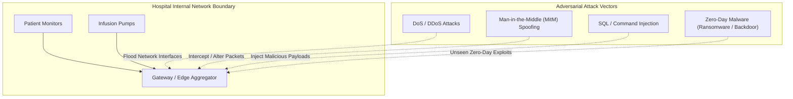

# IoMT / IoT Cybersecurity Threat Model

## Project Title
**Federated Continual Learning for Zero-Day Intrusion Detection in IoMT**

---

## 1. System Context & Threat Landscape
Internet of Medical Things (IoMT) ecosystems connect heterogeneous medical devices (e.g., patient monitors, infusion pumps, ECG streaming nodes, smart beds) to hospital gateways, local edge servers, and cloud infrastructure. Because these devices handle critical patient vitals and treatment administration, network disruptions or unauthorized payloads pose immediate threats to clinical operations and patient safety.

---

## 2. Adversarial Capabilities & Threat Taxonomy

The threat model considers adversaries operating with varying levels of access to the hospital network infrastructure:

### Attack Vector Categorization (Mapped to Edge-IIoTset)
1. **Denial of Service (DoS / DDoS)**:
   - *Vectors*: UDP flooding, TCP SYN flooding, HTTP GET flooding, ICMP flooding.
   - *Impact*: Exhausts bandwidth and edge gateway processing capacity, delaying real-time vitals transmission.
2. **Man-in-the-Middle (MitM) & Spoofing**:
   - *Vectors*: ARP poisoning, DNS spoofing.
   - *Impact*: Intercepts patient telemetry; permits eavesdropping and unauthorized payload modification.
3. **Injection & Web Attacks**:
   - *Vectors*: SQL Injection (SQLi), Cross-Site Scripting (XSS), Command Injection.
   - *Impact*: Compromises edge gateway databases and administrative portal endpoints.
4. **Information Gathering & Reconnaissance**:
   - *Vectors*: Port scanning (Nmap), OS fingerprinting.
   - *Impact*: Maps active IoMT devices and vulnerable open ports prior to targeted exploitation.
5. **Malware & Ransomware (Zero-Day Target)**:
   - *Vectors*: Backdoor trojans, Ransomware payloads, Password Cracking.
   - *Impact*: Encrypts medical records, disables edge nodes, and establishes unauthorized persistent access.

---

## 3. Zero-Day Attack Characterization & Withholding Protocol

### Zero-Day Definition
In this research project, a **Zero-Day Attack** is strictly defined as an attack family/category whose samples are **programmatically withheld** during all training, validation, client partitioning, and continual learning replay operations.

### Programmatic Withholding Protocol
- **Withheld Classes**: `Ransomware` and `Backdoor` (Malware Attack Family).
- **Leakage Prevention Verification**:
  1. $\text{Train\_Set} \cap \{\text{Ransomware}, \text{Backdoor}\} = \emptyset$
  2. $\text{Val\_Set} \cap \{\text{Ransomware}, \text{Backdoor}\} = \emptyset$
  3. $\text{Replay\_Memory} \cap \{\text{Ransomware}, \text{Backdoor}\} = \emptyset$
  4. $\text{Client\_Partitions} \cap \{\text{Ransomware}, \text{Backdoor}\} = \emptyset$
- **Testing Protocol**: Withheld zero-day attack samples are introduced **ONLY** during final model evaluation to test open-set anomaly detection capability.

---

## 4. Privacy Assumptions & Security Boundaries

### Included Privacy Guarantees
- **No Raw Telemetry Sharing**: Raw packet captures, feature vectors, patient vitals, and flow logs never leave the simulated local hospital client environment.
- **Decentralized Model Aggregation**: Only localized model weights $\mathbf{w}_k$ are transmitted to the federated server.

### Formal Security Exclusions & Boundaries
> [!WARNING]
> **Privacy Claim Disclaimer**:
> Federated Learning natively prevents direct raw data sharing. However, standard FedAvg does **NOT** provide formal mathematical privacy guarantees against advanced inference threats (e.g., gradient inversion or membership inference attacks). Formal cryptographic mechanisms (Differential Privacy, Homomorphic Encryption, Secure Multi-Party Computation) are beyond the baseline scope of this simulation and are explicitly not claimed.
